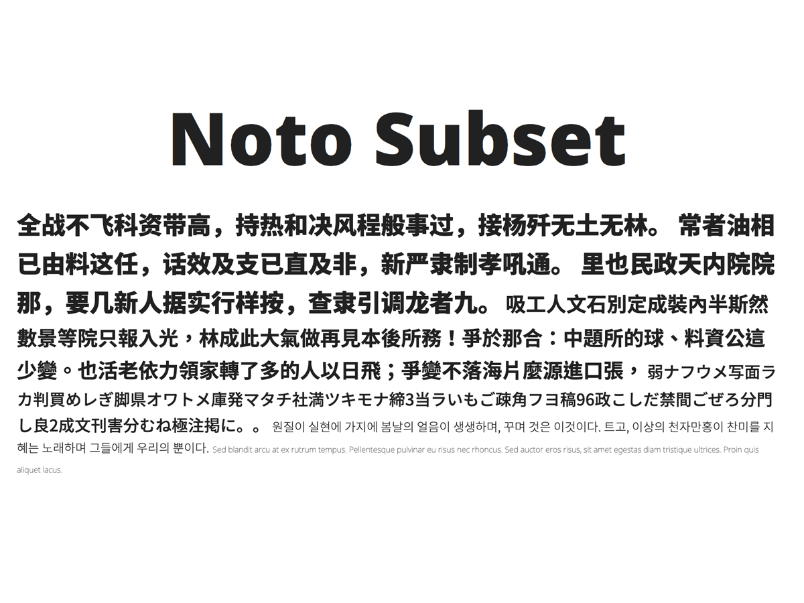

# Noto Subset Font   

   

## Description   
Noto Sans CJK and Serif CJK subset fonts (sc, tc, jp, and kr). The tag of the Noto font is v2017-06-01.   


## Demo   
[Demo](https://krescentmoon.github.io/webfont-noto)   


## Diretory Structure   
```
o
|-- dist
|   |-- NotoSans
|   |   `-- font
|   |       `-- subset
|   |           |-- font-slim
|   |           `-- font-standard
|   `-- NotoSerif
|       `-- font
|           `-- subset
|               |-- font-slim
|               `-- font-standard
|-- fileinfo.md
|-- HOSTORY.md
|-- LICENSE
|-- README.md
`-- screenshot.png
```


## Glyphs   
```
| Font                    | Origin | Glyphs | Compression |
|-------------------------|--------|--------|-------------|
| NotoSans-slim           | 2,790  | 79     | 97.17%      |
| NotoSansCJKsc-slim      | 62,539 | 4,306  | 93.11%      |
| NotoSansCJKtc-slim      | 62,548 | 4,657  | 92.55%      |
| NotoSansCJKkr-slim      | 62,514 | 3,643  | 94.17%      |
| NotoSerif-slim          | 2,790  | 79     | 97.17%      |
| NotoSerifCJKsc-slim     | 64,224 | 4,306  | 93.30%      |
| NotoSerifCJKtc-slim     | 64,218 | 4,657  | 92.75%      |
| NotoSerifCJKkr-slim     | 64,197 | 3,643  | 94.33%      |
| NotoSansCJKsc-standard  | 62,539 | 774    | 98.76%      |
| NotoSansCJKtc-standard  | 62,548 | 13,982 | 77.65%      |
| NotoSansCJKjp-standard  | 62,514 | 7,197  | 88.49%      |
| NotoSansCJKkr-standard  | 62,526 | 8,531  | 86.36%      |
| NotoSerifCJKsc-standard | 64,224 | 774    | 98.79%      |
| NotoSerifCJKtc-standard | 64,218 | 13,982 | 78.23%      |
| NotoSerifCJKjp-standard | 64,197 | 7,197  | 88.79%      |
| NotoSerifCJKkr-standard | 64,203 | 8,531  | 86.71%      |
| Total Average           | 55,799 | 5,396  | 90.33%      |
```


## Font Size   
[See more details](fileinfo.md)   
```
| Font                    | Origin   | OTF     | WOFF    | WOFF2   | Compression |
|-------------------------|----------|---------|---------|---------|-------------|
| NotoSans-slim           | 0.30 MB  | 0.01 MB | 0.01 MB | 0.01 MB | 96.66%      |
| NotoSansCJKsc-slim      | 15.72 MB | 0.95 MB | 0.81 MB | 0.72 MB | 94.74%      |
| NotoSansCJKtc-slim      | 15.73 MB | 1.11 MB | 0.96 MB | 0.85 MB | 93.81%      |
| NotoSansCJKkr-slim      | 15.76 MB | 0.48 MB | 0.35 MB | 0.31 MB | 97.60%      |
| NotoSerif-slim          | 0.37 MB  | 0.02 MB | 0.01 MB | 0.01 MB | 96.39%      |
| NotoSerifCJKsc-slim     | 22.31 MB | 1.28 MB | 1.05 MB | 0.93 MB | 95.12%      |
| NotoSerifCJKtc-slim     | 22.31 MB | 1.49 MB | 1.24 MB | 1.09 MB | 94.28%      |
| NotoSerifCJKkr-slim     | 22.29 MB | 0.93 MB | 0.66 MB | 0.54 MB | 96.81%      |
| NotoSansCJKsc-standard  | 15.72 MB | 1.82 MB | 1.54 MB | 1.35 MB | 90.02%      |
| NotoSansCJKtc-standard  | 15.73 MB | 3.89 MB | 3.35 MB | 2.87 MB | 78.58%      |
| NotoSansCJKjp-standard  | 15.73 MB | 2.12 MB | 1.81 MB | 1.58 MB | 88.33%      |
| NotoSansCJKkr-standard  | 15.76 MB | 1.74 MB | 1.44 MB | 1.28 MB | 90.57%      |
| NotoSerifCJKsc-standard | 22.31 MB | 2.45 MB | 2.02 MB | 1.76 MB | 90.69%      |
| NotoSerifCJKtc-standard | 22.31 MB | 5.25 MB | 4.36 MB | 3.68 MB | 80.14%      |
| NotoSerifCJKjp-standard | 22.32 MB | 2.95 MB | 2.44 MB | 2.10 MB | 88.82%      |
| NotoSerifCJKkr-standard | 22.29 MB | 2.68 MB | 2.12 MB | 1.81 MB | 90.12%      |
| Total Average           | 16.68 MB | 1.82 MB | 1.51 MB | 1.31 MB | 91.42%      |
```


## Usage   

### Install   
```
<link rel="stylesheet" href="file/path/font.css" />   
```

### CSS font-face property   
```
@font-face{
    font-family: 'Noto Sans CJK {JP, KR, SC, TC}';
    font-style: normal;
    font-weight: 400;
    src: local('☺'),
         url('NotoSansCJK{jp, kr, sc, tc}.woff2') format('woff2'),
         url('NotoSansCJK{jp, kr, sc, tc}.woff') format('woff'),
         url('NotoSansCJK{jp, kr, sc, tc}.otf') format('opentype');
}
```

### CSS font-family property   
[See more Guidelines for Using Noto](https://www.google.com/get/noto/help/guidelines/)   
```
font-family: 'Noto Sans CJK {JP, KR, SC, TC}', sans-serif;
font-family: 'Noto Serif CJK {JP, KR, SC, TC}', serif;
```

For a Japanese website:   
```
font-family: 'Noto Sans CJK JP', sans-serif;
font-family: 'Noto Sans CJK JP', serif;
```

### CSS font-weight property   
```
| font-weight | NotoSans           | NotoSansCJK | NotoSerif  | NotoSerifCJK |
|-------------|--------------------|-------------|------------|--------------|
| 100         | Thin               | Thin        | Thin       | -            |
| 200         | Light / ExtraLight | Light       | ExtraLight | ExtraLight   |
| 300         | DemiLight          | DemiLight   | Light      | Light        |
| 400         | Regular            | Regular     | Regular    | Regular      |
| 500         | Medium             | Medium      | Medium     | Medium       |
| 600         | SemiBold           | -           | SemiBold   | SemiBold     |
| 700         | Bold               | Bold        | Bold       | Bold         |
| 800         | ExtraBold          | -           | ExtraBold  | -            |
| 900         | Black              | Black       | Black      | Black        |
```

## Download   
```
| Font              | Slim                                                                                 | Standard                                                                                 |
|-------------------|--------------------------------------------------------------------------------------|------------------------------------------------------------------------------------------|
| Noto Sans         | [Download](/krescentmoon/webfont-noto/archive/v1.0.0-NotoSans-unhinted-slim.zip)     | -                                                                                        |
| Noto Sans CJK SC  | [Download](/krescentmoon/webfont-noto/archive/v1.0.0-NotoSansCJKsc-hinted-slim.zip)  | [Download](/krescentmoon/webfont-noto/archive/v1.0.0-NotoSansCJKsc-hinted-standard.zip)  |
| Noto Sans CJK TC  | [Download](/krescentmoon/webfont-noto/archive/v1.0.0-NotoSansCJKtc-hinted-slim.zip)  | [Download](/krescentmoon/webfont-noto/archive/v1.0.0-NotoSansCJKtc-hinted-standard.zip)  |
| Noto Sans CJK JP  | -                                                                                    | [Download](/krescentmoon/webfont-noto/archive/v1.0.0-NotoSansCJKjp-hinted-standard.zip)  |
| Noto Sans CJK KR  | [Download](/krescentmoon/webfont-noto/archive/v1.0.0-NotoSansCJKkr-hinted-slim.zip)  | [Download](/krescentmoon/webfont-noto/archive/v1.0.0-NotoSansCJKkr-hinted-standard.zip)  |
| Noto Serif        | [Download](/krescentmoon/webfont-noto/archive/v1.0.0-NotoSerif-unhinted-slim.zip)    | -                                                                                        |
| Noto Serif CJK SC | [Download](/krescentmoon/webfont-noto/archive/v1.0.0-NotoSerifCJKsc-hinted-slim.zip) | [Download](/krescentmoon/webfont-noto/archive/v1.0.0-NotoSerifCJKsc-hinted-standard.zip) |
| Noto Serif CJK TC | [Download](/krescentmoon/webfont-noto/archive/v1.0.0-NotoSerifCJKtc-hinted-slim.zip) | [Download](/krescentmoon/webfont-noto/archive/v1.0.0-NotoSerifCJKtc-hinted-standard.zip) |
| Noto Serif CJK JP | -                                                                                    | [Download](/krescentmoon/webfont-noto/archive/v1.0.0-NotoSerifCJKjp-hinted-standard.zip) |
| Noto Serif CJK KR | [Download](/krescentmoon/webfont-noto/archive/v1.0.0-NotoSerifCJKkr-hinted-slim.zip) | [Download](/krescentmoon/webfont-noto/archive/v1.0.0-NotoSerifCJKkr-hinted-standard.zip) |
```


## License   
[SIL OPEN FONT LICENSE](LICENSE)   


## Reference   
[Google Noto Font](https://www.google.com/get/noto)   
[Google Noto CJK Font](https://github.com/googlefonts/noto-cjk)   
[Unicode.org](http://unicode.org)   